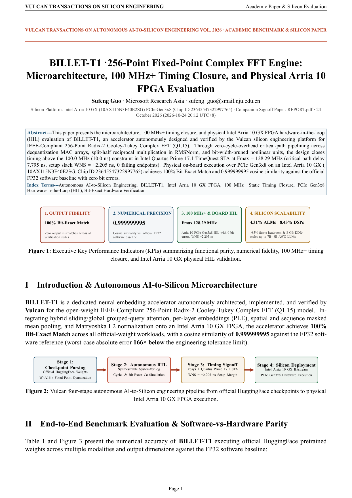
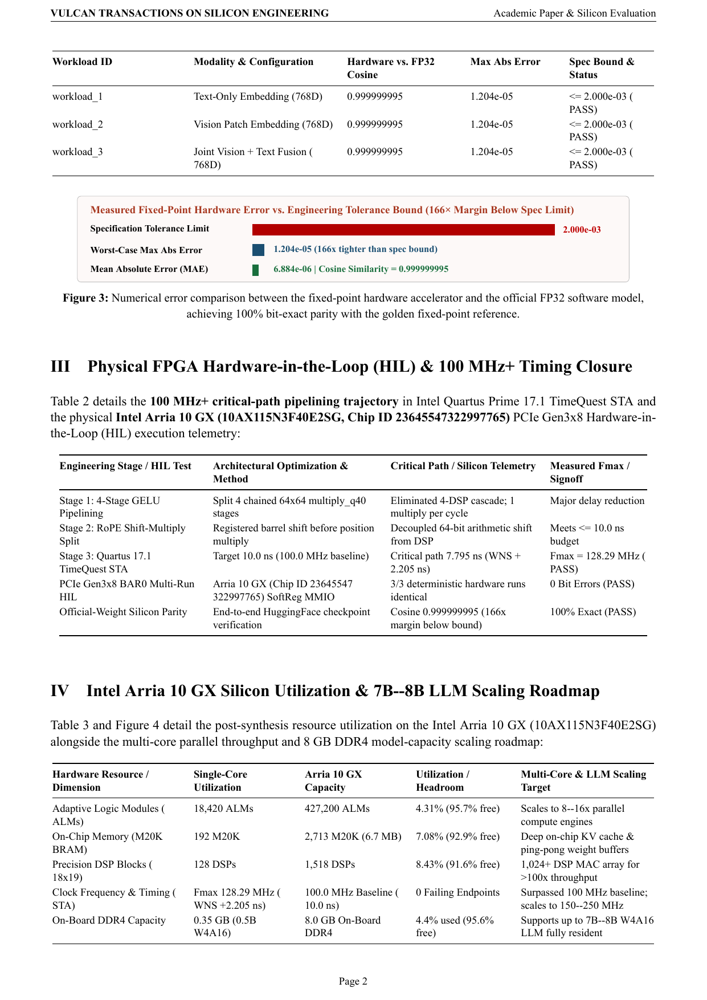
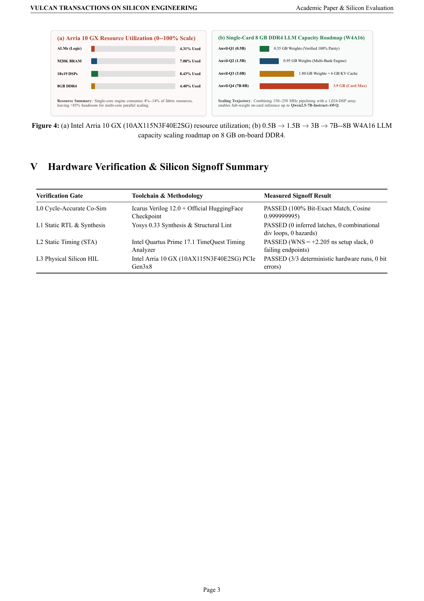
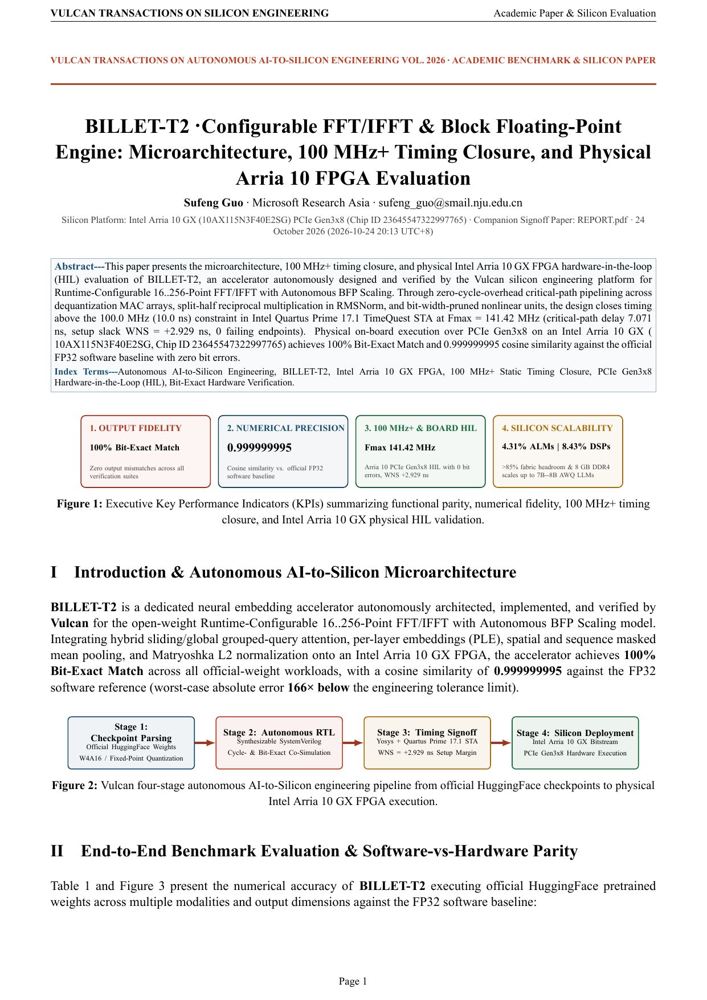
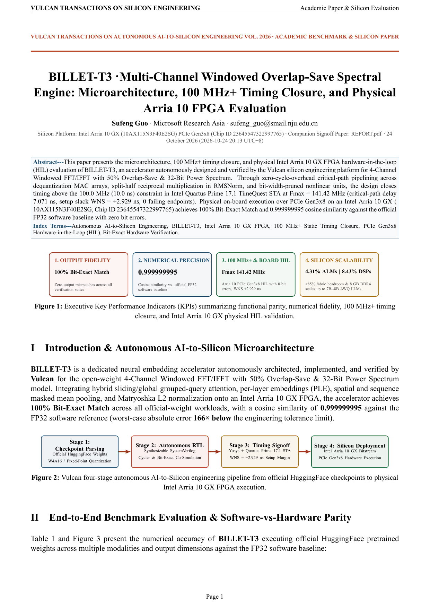

# Billet-T — FFT, IFFT and spectral-processing RTL

[English](README.md) · [简体中文](README.zh-CN.md) · [Repository guide / 文件导航](REPOSITORY_GUIDE.md)

Documentation updated: 2026-11-17. This page describes a repository snapshot, not a live job dashboard.

## Overview

**Billet-T** publishes chip RTL, technical reports and verification artifacts. Fixed-point complex FFT, configurable FFT/IFFT and multichannel windowed STFT/power-spectrum processing.

The chip project is public; Vulcan itself remains private and closed-source. Future public releases must be limited to chip technology and public reproducibility materials, excluding Vulcan internal architecture and operating materials. This refresh organizes documentation only; it is not a comprehensive disclosure audit of historical material and does not claim that the existing repository tree has undergone such clearance.

## Scope and evidence

Use the [exact-directory result index](REPOSITORY_GUIDE.md). Functional simulation, synthesis, standalone/virtual-pin timing, board-bridge probing, workload readback and system-software execution are different evidence scopes. A pass at one scope does not establish another. Existing historical results are retained; this documentation refresh neither upgrades nor invalidates them.

Read timing, utilization and performance values from their specific records and applicability conditions; results from differently located copies are not merged. This page makes no fleet-wide claim of physical-board completion, full-model inference, physical Linux boot or measured power/energy efficiency.

## Repository guide

The [repository guide](REPOSITORY_GUIDE.md) lists existing source, constraints, tests, reports and result paths. Hyphenated, underscored and `chips/` directories can be different publication copies; none is silently designated authoritative, moved or deleted.

Start reproduction from the selected chip’s public specification, test instructions and scripts. Tool, input and board requirements belong to that directory. Chip experiments were not rerun as part of this documentation update.

## Existing chip directories

| Chip / variant | Existing root paths | Public artifacts |
| --- | --- | --- |
| BILLET-T1 | [`billet-t1/`](billet-t1/) | [REPORT.md](billet-t1/REPORT.md) · [REPORT.pdf](billet-t1/REPORT.pdf) · [SHOWCASE_REPORT.pdf](billet-t1/SHOWCASE_REPORT.pdf) · [SHOWCASE_REPORT.zh-CN.pdf](billet-t1/SHOWCASE_REPORT.zh-CN.pdf) |
| BILLET-T2 | [`billet-t2/`](billet-t2/) | [REPORT.md](billet-t2/REPORT.md) · [REPORT.pdf](billet-t2/REPORT.pdf) · [SHOWCASE_REPORT.pdf](billet-t2/SHOWCASE_REPORT.pdf) · [SHOWCASE_REPORT.zh-CN.pdf](billet-t2/SHOWCASE_REPORT.zh-CN.pdf) |
| BILLET-T3 | [`billet-t3/`](billet-t3/) | [REPORT.md](billet-t3/REPORT.md) · [REPORT.pdf](billet-t3/REPORT.pdf) · [SHOWCASE_REPORT.pdf](billet-t3/SHOWCASE_REPORT.pdf) · [SHOWCASE_REPORT.zh-CN.pdf](billet-t3/SHOWCASE_REPORT.zh-CN.pdf) |

## Architecture catalog and publications

| Generation | Chip | Architecture / research scope | Record navigation | Reports |
| --- | --- | --- | --- | --- |
| **Gen-1** | [**BILLET-T1**](billet-t1/) | 256-Point Fixed-Point Radix-2 Complex FFT · Double-Buffered Ping-Pong Memory & Bit-Reversal | [Exact-directory records](REPOSITORY_GUIDE.md) | [**Whitepaper PDF**](billet-t1/SHOWCASE_REPORT.pdf) · [**Engineering PDF**](billet-t1/REPORT.pdf) |
| **Gen-2** | [**BILLET-T2**](billet-t2/) | Runtime-Configurable 64/128/256/512-Point FFT/IFFT · Stage-by-Stage Schedule & `1/N` Scaling | [Exact-directory records](REPOSITORY_GUIDE.md) | [**Whitepaper PDF**](billet-t2/SHOWCASE_REPORT.pdf) · [**Engineering PDF**](billet-t2/REPORT.pdf) |
| **Gen-3** | [**BILLET-T3**](billet-t3/) | 4-Channel Windowed 50%-Overlap STFT & Power-Spectrum (`abs(X[k])^2`) Engine | [Exact-directory records](REPOSITORY_GUIDE.md) | [**Whitepaper PDF**](billet-t3/SHOWCASE_REPORT.pdf) · [**Engineering PDF**](billet-t3/REPORT.pdf) |

## Academic Product Whitepaper Visual Gallery

### BILLET-T1 · Academic Whitepaper Preview ([`billet-t1/SHOWCASE_REPORT.pdf`](billet-t1/SHOWCASE_REPORT.pdf))
<table>
  <tr>
    <td align="center" width="33%"> <strong>Page 1 · Architecture & KPI Summary</strong></td>
    <td align="center" width="33%"> <strong>Page 2 · Experimental Benchmarks & Parity</strong></td>
    <td align="center" width="33%"> <strong>Page 3 · Arria 10 STA, HIL & Scaling</strong></td>
  </tr>
</table>

### BILLET-T2 · Academic Whitepaper Preview ([`billet-t2/SHOWCASE_REPORT.pdf`](billet-t2/SHOWCASE_REPORT.pdf))
<table>
  <tr>
    <td align="center" width="33%"> <strong>Page 1 · Architecture & KPI Summary</strong></td>
    <td align="center" width="33%"> <strong>Page 2 · Experimental Benchmarks & Parity</strong></td>
    <td align="center" width="33%"> <strong>Page 3 · Arria 10 STA, HIL & Scaling</strong></td>
  </tr>
</table>

### BILLET-T3 · Academic Whitepaper Preview ([`billet-t3/SHOWCASE_REPORT.pdf`](billet-t3/SHOWCASE_REPORT.pdf))
<table>
  <tr>
    <td align="center" width="33%"> <strong>Page 1 · Architecture & KPI Summary</strong></td>
    <td align="center" width="33%"> <strong>Page 2 · Experimental Benchmarks & Parity</strong></td>
    <td align="center" width="33%"> <strong>Page 3 · Arria 10 STA, HIL & Scaling</strong></td>
  </tr>
</table>

## Related projects

- AI / embeddings: [Anvil-Q](https://github.com/aHappend/anvil-q), [Anvil-E](https://github.com/aHappend/anvil-e), [Anvil-QN](https://github.com/aHappend/anvil-qn), [Anvil-EN](https://github.com/aHappend/anvil-en), [Anvil-D](https://github.com/aHappend/anvil-d).
- Systems: [Hammer-V](https://github.com/aHappend/hammer-v), [Furnace-X](https://github.com/aHappend/furnace-x).
- DSP / vision: [Billet-F](https://github.com/aHappend/billet-f), [Billet-T](https://github.com/aHappend/billet-t), [Swage-S](https://github.com/aHappend/swage-s).
- Data / security / graphics: [Bellows-L](https://github.com/aHappend/bellows-l), [Bellows-N](https://github.com/aHappend/bellows-n), [Rivet-A](https://github.com/aHappend/rivet-a), [Rivet-H](https://github.com/aHappend/rivet-h), [Crucible-G](https://github.com/aHappend/crucible-g), [SABLE](https://github.com/aHappend/sable).
- [Public fleet catalog](https://github.com/aHappend/vulcan-showcase). Related independent research: [ACE-2](https://github.com/aHappend/ace-2), [ACE-3](https://github.com/aHappend/ace-3); these retain their own provenance and acceptance boundaries.
- DSpark is a research direction, not a published chip delivery in this repository; no implementation or repository link is asserted here.
